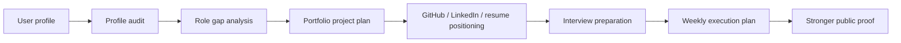

# Occupation-Ops

## Become more hireable before you apply

Occupation-Ops is an **AI Career Operating System** for modern knowledge
workers. It helps users audit their current profile, find role gaps, plan
portfolio proof projects, improve GitHub/LinkedIn/resume positioning, prepare
for interviews, and turn career strategy into weekly execution.

This is an MVP, not a finished SaaS. The current version is a local,
file-based toolkit with templates, occupation tracks, workflow modes, and small
Node.js CLI commands.

```text
profile -> role gaps -> proof projects -> positioning -> interview prep -> weekly execution
```

## Try The Demo In 60 Seconds

```bash
git clone https://github.com/AnkitParekh007/occupation-ops.git
cd occupation-ops
npm install
npm run demo:ai-frontend
```

The demo writes a sample report to:

```text
output/demo-ai-frontend-architect-report.md
```

You can also run the smaller MVP commands:

```bash
npm run doctor
npm run audit:profile
npm run plan:weekly
```

To customize the input profile on Windows:

```bash
copy templates\profile.example.yml profile.yml
```

On macOS/Linux:

```bash
cp templates/profile.example.yml profile.yml
```

## Sample Output

The flagship demo creates a report with:

- Profile summary
- Target role
- Current positioning score
- Missing proof signals
- GitHub profile rewrite
- Three portfolio project ideas
- 30-day roadmap
- Weekly execution checklist
- Interview preparation topics
- Truthfulness guardrails

Excerpt:

```md
## Profile Score

Score: 6.5/10

Strong Angular and TypeScript direction, but the profile needs clearer public
proof around AI copilot UX, RAG citations, tool execution, and approval flows.
```

## Who This Is For

- Frontend engineers moving into AI product engineering.
- Angular, React, QA, product, data, DevOps, and design professionals who need
  clearer public proof.
- Job seekers who want stronger positioning before applying.
- Career coaches and mentors who want reusable audit templates.
- Open-source contributors building career-tech workflows.

## What This Is Not

- Not a hosted recruiting service.
- Not a job spam or mass-apply tool.
- Not a promise of employment outcomes.
- Not a resume fakery generator.
- Not an ATS bypass product.
- Not a replacement for human review.

## Why Star This Repo?

- Follow a practical open-source MVP for career-readiness workflows.
- Reuse occupation tracks, templates, and weekly execution plans.
- Study how AI agent workflows can support truthful career positioning.
- Contribute new tracks, modes, examples, and CLI improvements.
- Help shape an original career-tech system focused on proof before applying.

## How It Works



## Features

| Feature | Status | Purpose |
| --- | --- | --- |
| Profile audit | MVP | Review current public proof and positioning. |
| Role-gap analysis | MVP | Compare current proof against target occupation expectations. |
| GitHub growth mode | MVP | Improve profile README, repo clarity, topics, and contribution surfaces. |
| Portfolio builder | MVP | Plan role-specific proof projects. |
| Resume builder | Template | Align resume language without fake claims. |
| Interview prep | Template | Convert proof projects into interview stories. |
| Weekly plan generator | MVP | Turn strategy into a one-week execution checklist. |
| Occupation tracks | MVP | Define what credible proof looks like for different roles. |

## Flagship Workflow: AI Frontend Architect

The first complete workflow helps a user target AI Frontend Architect roles by
auditing current proof and creating an execution plan around:

- GitHub and resume positioning
- AI copilot UI proof
- RAG citation UX
- MCP/tool execution UX
- UI-aware agents
- action approvals
- interview preparation
- weekly execution

Start with:

- [AI Frontend Architect Track](tracks/ai-frontend-architect.md)
- [Sample profile](examples/ai-frontend-architect/sample-profile.yml)
- [Sample gap analysis](examples/ai-frontend-architect/sample-gap-analysis.md)
- [Sample weekly plan](examples/ai-frontend-architect/sample-weekly-plan.md)

## Occupation Tracks

- [AI Frontend Architect](tracks/ai-frontend-architect.md)
- [Frontend Engineer](tracks/frontend-engineer.md)
- [QA Engineer](tracks/qa-engineer.md)
- [Product Manager](tracks/product-manager.md)
- [UI/UX Designer](tracks/ui-ux-designer.md)
- [Data Analyst](tracks/data-analyst.md)
- [DevOps Engineer](tracks/devops-engineer.md)

## Workflow Modes

- [Profile Audit](modes/profile-audit.md)
- [Role Gap Analysis](modes/role-gap-analysis.md)
- [GitHub Growth](modes/github-growth.md)
- [Portfolio Builder](modes/portfolio-builder.md)
- [Resume Builder](modes/resume-builder.md)
- [Interview Prep](modes/interview-prep.md)
- [Job Fit Evaluator](modes/job-fit-evaluator.md)
- [LinkedIn Optimizer](modes/linkedin-optimizer.md)
- [Weekly Career Plan](modes/weekly-career-plan.md)
- [Learning Roadmap](modes/learning-roadmap.md)

## Good First Issues

- Add a new occupation track.
- Add a sample profile for a non-frontend role.
- Improve the weekly plan generator output.
- Add JSON output to the CLI.
- Add scoring rubrics for each track.
- Add screenshots for generated sample reports.
- Add tests for the Node.js scripts.
- Improve docs for career coaches and mentors.

## Project Structure

```text
occupation-ops/
  AGENTS.md
  OCCUPATION_CONTRACT.md
  docs/
  tracks/
  modes/
  templates/
  examples/
  scripts/
```

## Roadmap

See [docs/ROADMAP.md](docs/ROADMAP.md).

Near-term priorities:

- Improve role-specific scoring rubrics.
- Add JSON output from scripts.
- Add more sample profiles.
- Add screenshot examples.
- Add tests for CLI commands.
- Add a lightweight local dashboard later.

## Contributing

Contributions are welcome around:

- occupation tracks
- workflow modes
- templates
- example profiles
- CLI improvements
- launch docs
- truthful positioning guardrails

Read [CONTRIBUTING.md](CONTRIBUTING.md) before opening a PR.

## Attribution

Occupation-Ops is an original repositioning focused on occupation readiness,
public proof, portfolio planning, and weekly execution. It may be inspired by
the broader category of AI-assisted career operations tools, including
career-ops, but it does not claim the original project's author story, metrics,
screenshots, community links, or outcomes.

## Safety And Ethics

- Do not fake experience, metrics, employment history, or endorsements.
- Do not mass-apply or spam recruiters.
- Do not automate third-party websites against their terms.
- Always review AI-generated career material before publishing or sending it.
- Keep private data out of git.

## License

MIT. See [LICENSE](LICENSE).
