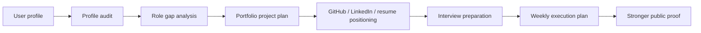

# Occupation-Ops

## AI Career Operating System for modern knowledge workers

Occupation-Ops helps people become more hireable before they apply.

It gives users a local, file-based workflow for profile audits, role-gap
analysis, GitHub growth, portfolio project planning, interview preparation, and
weekly execution plans.

This repository is an MVP. It is not a finished SaaS, not a job automation
platform, and not a promise of employment outcomes.

```text
profile audit -> role gaps -> proof projects -> positioning -> interview prep -> weekly execution
```

## Try The Demo In 60 Seconds

```bash
git clone https://github.com/AnkitParekh007/occupation-ops.git
cd occupation-ops
npm install
npm run demo:ai-frontend
```

The demo generates:

```text
output/demo-ai-frontend-architect-report.md
```

You can also run:

```bash
npm run doctor
npm run audit:profile
npm run plan:weekly
```

To customize the example profile on Windows:

```bash
copy templates\profile.example.yml profile.yml
```

On macOS/Linux:

```bash
cp templates/profile.example.yml profile.yml
```

## Sample Output

The flagship AI Frontend Architect demo report includes:

- Profile Score
- Target Role Fit
- Missing Proof Signals
- GitHub Profile Rewrite
- 3 Portfolio Project Ideas
- 30-Day Roadmap
- Weekly Execution Checklist
- Interview Prep Map
- Truthfulness Guardrails

Example excerpt:

```md
## Profile Score

Score: 6.5/10

Strong Angular and TypeScript direction, but the profile needs clearer public
proof around AI copilot UX, RAG citations, tool execution, and approval flows.
```

## Who This Is For

- Frontend engineers moving into AI product engineering.
- Knowledge workers who need stronger public proof before applying.
- Career coaches and mentors who want reusable audit templates.
- Open-source contributors interested in career-tech workflows.
- Developers who want a local-first career execution system.

## What This Is Not

- Not a hosted recruiting service.
- Not a mass-apply tool.
- Not a resume fakery generator.
- Not an ATS bypass product.
- Not a replacement for human review.
- Not a guarantee of interviews, offers, or hiring outcomes.

## Why Star This Repo?

- Follow a practical open-source MVP for career-readiness workflows.
- Reuse occupation tracks, workflow modes, and weekly execution plans.
- Study how AI agent workflows can support truthful career positioning.
- Contribute new tracks, templates, examples, and CLI improvements.
- Help shape an original career-tech system focused on proof before applying.

## Features

| Feature | Status | Purpose |
| --- | --- | --- |
| Profile audit | MVP | Review current public proof and positioning. |
| Role-gap analysis | MVP | Compare current proof against target role expectations. |
| GitHub growth mode | MVP | Improve profile README, repo clarity, topics, and contribution surfaces. |
| Portfolio builder | MVP | Plan role-specific proof projects. |
| Resume builder | Template | Align resume language without fake claims. |
| Interview prep | Template | Convert proof projects into interview stories. |
| Weekly plan generator | MVP | Turn strategy into one week of execution. |
| Occupation tracks | MVP | Define credible proof for different roles. |

## How It Works



## AI Frontend Architect Flagship Workflow

The first complete workflow targets AI Frontend Architect roles.

It helps a user audit current proof and build an execution plan around:

- GitHub and resume positioning
- AI copilot UI proof
- RAG citation UX
- MCP/tool execution UX
- UI-aware agents
- action approvals
- interview preparation
- weekly execution

Start here:

- [AI Frontend Architect Track](tracks/ai-frontend-architect.md)
- [Sample profile](examples/ai-frontend-architect/sample-profile.yml)
- [Sample gap analysis](examples/ai-frontend-architect/sample-gap-analysis.md)
- [Sample weekly plan](examples/ai-frontend-architect/sample-weekly-plan.md)

## Occupation Tracks

- [AI Frontend Architect](tracks/ai-frontend-architect.md)
- [Frontend Engineer](tracks/frontend-engineer.md)
- [QA Engineer](tracks/qa-engineer.md)
- [Product Manager](tracks/product-manager.md)
- [UI/UX Designer](tracks/ui-ux-designer.md)
- [Data Analyst](tracks/data-analyst.md)
- [DevOps Engineer](tracks/devops-engineer.md)

## Workflow Modes

- [Profile Audit](modes/profile-audit.md)
- [Role Gap Analysis](modes/role-gap-analysis.md)
- [GitHub Growth](modes/github-growth.md)
- [Portfolio Builder](modes/portfolio-builder.md)
- [Resume Builder](modes/resume-builder.md)
- [Interview Prep](modes/interview-prep.md)
- [Job Fit Evaluator](modes/job-fit-evaluator.md)
- [LinkedIn Optimizer](modes/linkedin-optimizer.md)
- [Weekly Career Plan](modes/weekly-career-plan.md)
- [Learning Roadmap](modes/learning-roadmap.md)

## Good First Issues

- Add a new occupation track.
- Add a sample profile for a non-frontend role.
- Improve the weekly plan generator output.
- Add JSON output to the CLI.
- Add scoring rubrics for each track.
- Add screenshots for generated sample reports.
- Add tests for the Node.js scripts.
- Improve docs for career coaches and mentors.

## Roadmap

See [docs/ROADMAP.md](docs/ROADMAP.md).

Near-term priorities:

- Improve role-specific scoring rubrics.
- Add JSON output from scripts.
- Add more sample profiles.
- Add screenshot examples.
- Add tests for CLI commands.
- Add a lightweight local dashboard later.

## Attribution

Occupation-Ops is an original repositioning focused on occupation readiness,
public proof, portfolio planning, and weekly execution. It may be inspired by
the broader category of AI-assisted career operations tools, including
career-ops, but it does not claim the original project's author story, metrics,
screenshots, community links, or outcomes.

## Safety And Ethics

- Do not fake experience, metrics, employment history, or endorsements.
- Do not mass-apply or spam recruiters.
- Do not automate third-party websites against their terms.
- Always review generated career material before publishing or sending it.
- Keep private data out of git.

## Contributing

Contributions are welcome around occupation tracks, workflow modes, templates,
examples, CLI improvements, and truthfulness guardrails.

Read [CONTRIBUTING.md](CONTRIBUTING.md) before opening a PR.

## License

MIT. See [LICENSE](LICENSE).
