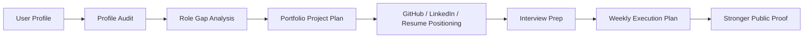

# Occupation-Ops

## AI Career Operating System for Modern Knowledge Workers

Occupation-Ops helps people become more hireable before they apply. It audits a
user's current profile, identifies role gaps, plans portfolio proof projects,
improves GitHub, LinkedIn, and resume positioning, prepares interviews, and
generates weekly execution plans.

This is an open-source career operating system, not a job spam tool. The goal is
to help users build stronger public proof, better positioning, and more focused
career execution.

> Status: MVP. The workflows are file-based and script-assisted today. The
> system is designed to grow into a contributor-friendly career-tech toolkit.

## Tagline

Become more hireable before you apply.

## What Makes This Different

Occupation-Ops focuses on occupation readiness, not just application tracking.
It starts with the target role, maps the user's current proof, finds missing
signals, and turns those gaps into weekly execution plans.

| Layer | What it does |
| --- | --- |
| Profile audit | Reviews GitHub, resume, LinkedIn, portfolio, skills, and proof gaps. |
| Role gap analysis | Compares current positioning against a target occupation. |
| Portfolio planning | Generates proof projects that make the target role believable. |
| Public proof | Improves GitHub profile, repo READMEs, LinkedIn, and portfolio copy. |
| Interview prep | Turns proof projects into talking points and story banks. |
| Weekly execution | Converts strategy into small, reviewable career tasks. |

## Quick Start

```bash
git clone https://github.com/AnkitParekh007/occupation-ops.git
cd occupation-ops
npm install

npm run doctor
npm run audit:profile
npm run plan:weekly
```

Copy the example profile and edit it with your own details:

```bash
copy templates\profile.example.yml profile.yml
```

On macOS/Linux:

```bash
cp templates/profile.example.yml profile.yml
```

## Flagship Workflow: AI Frontend Architect Track

The first flagship workflow helps a user move toward AI Frontend Architect
roles. It guides the user through:

1. Auditing GitHub, resume, LinkedIn, and portfolio positioning.
2. Defining target roles and role-specific proof signals.
3. Identifying missing proof projects.
4. Generating three portfolio project ideas.
5. Rewriting GitHub profile positioning.
6. Creating a 30-day roadmap.
7. Preparing interview topics.
8. Producing a weekly execution checklist.

Start here:

- [AI Frontend Architect Track](tracks/ai-frontend-architect.md)
- [Sample profile](examples/ai-frontend-architect/sample-profile.yml)
- [Sample gap analysis](examples/ai-frontend-architect/sample-gap-analysis.md)
- [Sample weekly plan](examples/ai-frontend-architect/sample-weekly-plan.md)

## Features

| Feature | Status | Why it matters |
| --- | --- | --- |
| Profile audit | MVP | Helps users see what recruiters and hiring managers see first. |
| Role gap analysis | MVP | Turns vague career goals into concrete missing signals. |
| GitHub growth mode | MVP | Improves profile README, repo clarity, topics, and contribution surfaces. |
| Portfolio builder | MVP | Creates proof project plans tied to target occupations. |
| Resume builder | Template | Helps align experience with target role language without fake claims. |
| Interview prep | Template | Converts projects and experience into interview-ready stories. |
| Weekly plan generator | MVP | Converts roadmap items into focused weekly execution tasks. |
| Occupation tracks | MVP | Provides role-specific checklists and proof expectations. |

## How It Works



## Occupation Tracks

Occupation tracks define what credible proof looks like for a target role.

- [AI Frontend Architect](tracks/ai-frontend-architect.md)
- [Frontend Engineer](tracks/frontend-engineer.md)
- [QA Engineer](tracks/qa-engineer.md)
- [Product Manager](tracks/product-manager.md)
- [UI/UX Designer](tracks/ui-ux-designer.md)
- [Data Analyst](tracks/data-analyst.md)
- [DevOps Engineer](tracks/devops-engineer.md)

## Modes

Modes are reusable workflows that can be run manually, with an AI coding agent,
or through the MVP Node.js scripts.

- [Profile Audit](modes/profile-audit.md)
- [Role Gap Analysis](modes/role-gap-analysis.md)
- [GitHub Growth](modes/github-growth.md)
- [Portfolio Builder](modes/portfolio-builder.md)
- [Resume Builder](modes/resume-builder.md)
- [Interview Prep](modes/interview-prep.md)
- [Job Fit Evaluator](modes/job-fit-evaluator.md)
- [LinkedIn Optimizer](modes/linkedin-optimizer.md)
- [Weekly Career Plan](modes/weekly-career-plan.md)
- [Learning Roadmap](modes/learning-roadmap.md)

## Repository Structure

```text
occupation-ops/
  AGENTS.md
  CLAUDE.md
  GEMINI.md
  OCCUPATION_CONTRACT.md
  CONTRIBUTING.md
  SECURITY.md
  docs/
    SETUP.md
    ARCHITECTURE.md
    ROADMAP.md
  tracks/
    ai-frontend-architect.md
    frontend-engineer.md
    qa-engineer.md
    product-manager.md
    ui-ux-designer.md
    data-analyst.md
    devops-engineer.md
  modes/
    profile-audit.md
    role-gap-analysis.md
    github-growth.md
    portfolio-builder.md
    resume-builder.md
    interview-prep.md
    job-fit-evaluator.md
    linkedin-optimizer.md
    weekly-career-plan.md
    learning-roadmap.md
  templates/
    profile.example.yml
    resume-template.md
    github-readme-template.md
    portfolio-project-template.md
    weekly-plan-template.md
    interview-story-bank.md
  examples/
    ai-frontend-architect/
      sample-profile.yml
      sample-gap-analysis.md
      sample-weekly-plan.md
  scripts/
    doctor.mjs
    run-profile-audit.mjs
    generate-weekly-plan.mjs
```

## CLI Prototype

The CLI is intentionally simple in this MVP. It reads local Markdown/YAML files
and prints practical next steps.

```bash
npm run doctor
npm run audit:profile
npm run plan:weekly
```

Current limitations:

- No hosted service.
- No automatic LinkedIn or GitHub writes.
- No job applications are submitted.
- No claims are made about employment outcomes.

## Roadmap

See [docs/ROADMAP.md](docs/ROADMAP.md).

Near-term priorities:

- Improve role-specific scoring rubrics.
- Add more sample profiles.
- Add JSON output from scripts.
- Add GitHub issue templates.
- Add screenshot examples for profile and portfolio audits.
- Add a lightweight web dashboard.

## Contributing

Contributions are welcome around:

- Occupation tracks.
- Mode prompts.
- Templates.
- Sample profiles.
- CLI improvements.
- Documentation.
- Guardrails for truthful positioning.
- Accessibility and UX for future dashboards.

Read [CONTRIBUTING.md](CONTRIBUTING.md) before opening a PR.

## Attribution

Occupation-Ops may be inspired by the broader category of AI-assisted career
operations tools, including career-ops. This repository is being repositioned as
an original project focused on occupation readiness, public proof, portfolio
planning, and weekly execution systems.

It does not claim the original career-ops author's story, metrics, screenshots,
social links, community links, or outcomes.

## Safety And Ethics

- Do not fake experience, metrics, employment history, or endorsements.
- Do not mass-apply or spam recruiters.
- Do not scrape or automate third-party websites against their terms.
- Always review AI-generated career material before publishing or sending it.
- Keep private data out of git.

## License

MIT. See [LICENSE](LICENSE).
