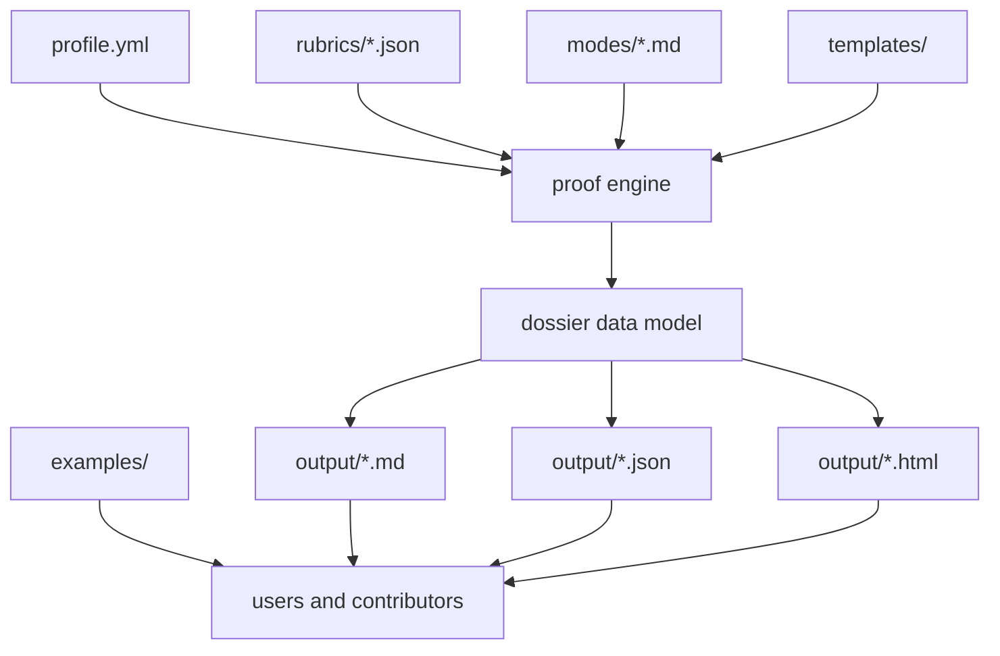

# Occupation-Ops Architecture

Occupation-Ops is a local-first proof engine. It does not track applications.
It turns a candidate profile into structured proof outputs that can be reviewed,
committed, and extended locally.

## Core flow

## Why this shape

- keep user data local
- keep scoring data-driven instead of prose-hardcoded
- make outputs inspectable without a backend
- keep the repo easy to extend with new rubrics and renderers
- preserve truthfulness boundaries between proof and aspiration

## Main layers

| Layer | Purpose |
| --- | --- |
| `profile.yml` | candidate data, links, proof list, skills, constraints |
| `rubrics/*.json` | role-specific scoring, project briefs, checklist logic |
| `scripts/lib/proof-engine.mjs` | converts profile + rubric into one canonical dossier |
| `scripts/lib/renderers.mjs` | renders Markdown, JSON, and standalone HTML |
| `scripts/*.mjs` | thin workflow wrappers around the shared dossier |
| `output/` | generated proof artifacts |

## Extension points

### Add a new track

1. Create or update the human-readable track in `tracks/`.
2. Add a structured rubric in `rubrics/`.
3. Reuse the shared engine so the new role gets scorecards, validators, and
   bundle outputs automatically.

### Add a new rubric schema field

1. Extend the rubric JSON.
2. Update `scripts/lib/proof-engine.mjs` to compute the derived behavior.
3. Update `scripts/lib/renderers.mjs` if the field should appear in outputs.
4. Add a fixture test that locks the behavior.

### Add a new renderer

1. Reuse the dossier returned by `buildProofDossier`.
2. Add a renderer in `scripts/lib/renderers.mjs` or a sibling module.
3. Write the artifact to `output/` without changing the scoring engine.

## Non-goals

- hosted multi-user platform
- recruiter scraping
- application tracking
- job-board scanning
- auto-submitting job applications
- fake ATS or hiring guarantees
