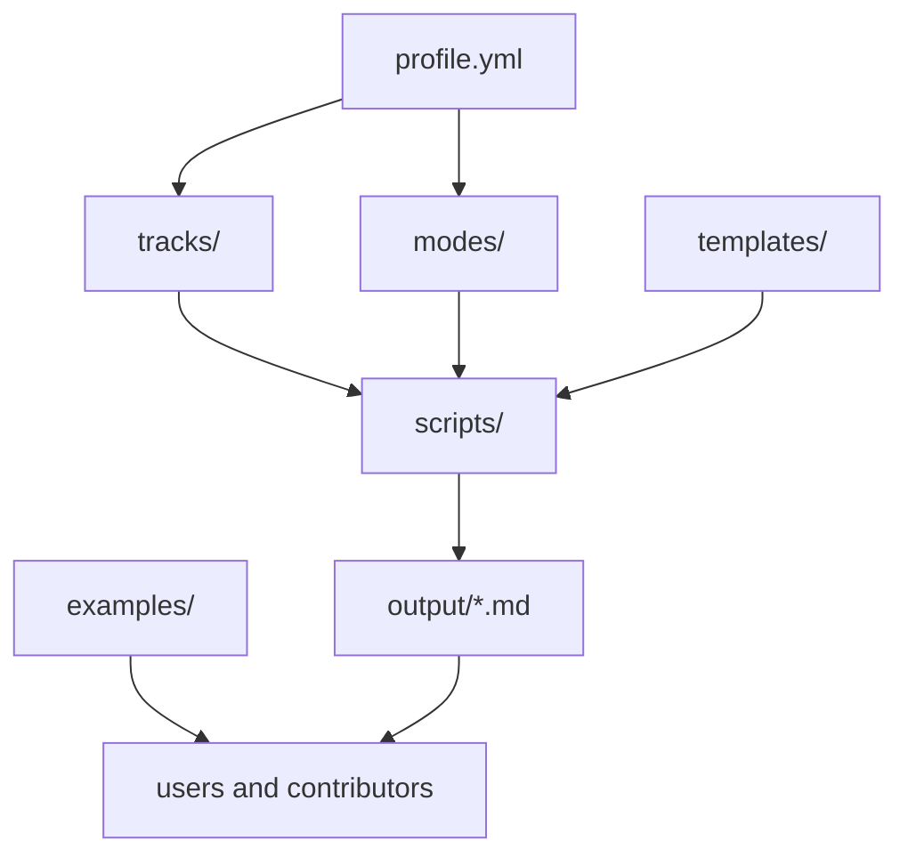

# Occupation-Ops Architecture

Occupation-Ops is intentionally local-first and file-based.

## Core design

## Why this architecture exists

- keep user data local
- avoid SaaS assumptions
- make outputs easy to inspect and edit
- keep the workflow scriptable and contributor-friendly
- make proof planning visible as Markdown artifacts

## Main folders

| Folder | Purpose |
| --- | --- |
| `tracks/` | role-specific proof expectations |
| `modes/` | workflow definitions and user-facing operating modes |
| `templates/` | reusable output and input templates |
| `examples/` | sample profiles and reports |
| `scripts/` | local generators and repo utilities |
| `output/` | generated user artifacts |

## Workflow pattern

1. Start with a truthful `profile.yml`.
2. Select a track and one or more modes.
3. Run local scripts that generate Markdown outputs.
4. Review the outputs manually.
5. Turn the outputs into real proof projects, README improvements, GitHub growth actions, and interview stories.

## Non-goals

- hosted multi-user platform
- recruiter scraping
- mass-application automation
- fake ATS promises
- auto-submission to job portals
