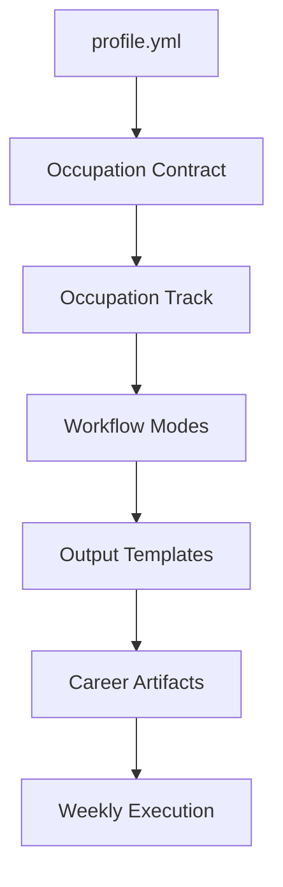

# Architecture

Occupation-Ops is intentionally file-first.

## Core Concepts

## Layers

| Layer | Folder | Purpose |
| --- | --- | --- |
| Contract | `OCCUPATION_CONTRACT.md` | Defines truthful inputs and outputs. |
| Tracks | `tracks/` | Role-specific proof expectations. |
| Modes | `modes/` | Reusable workflows. |
| Templates | `templates/` | Structured output formats. |
| Examples | `examples/` | Sample end-to-end outputs. |
| Scripts | `scripts/` | MVP automation helpers. |

## MVP Script Design

- `scripts/doctor.mjs` checks expected files and folders.
- `scripts/run-profile-audit.mjs` reads a profile file and prints an audit.
- `scripts/generate-weekly-plan.mjs` creates a simple weekly checklist.

Future versions can add JSON output, richer scoring, local dashboards, and
optional AI-provider integrations.
